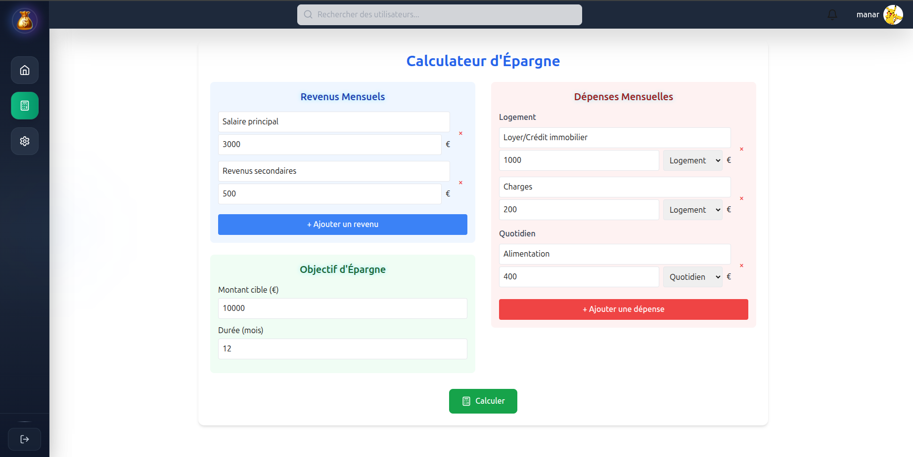

# CashUp - Calculateur d'Épargne Intelligent 💰

## 📖 Description

CashUp est une application web moderne de gestion financière personnelle qui aide les utilisateurs à planifier et atteindre leurs objectifs d'épargne. L'application analyse vos revenus et dépenses pour calculer votre capacité d'épargne et vous proposer des stratégies personnalisées pour atteindre vos objectifs financiers.

## ✨ Fonctionnalités principales

### 💼 Gestion des Revenus
- **Salaire principal** : Saisie du revenu principal
- **Revenus secondaires** : Ajout de sources de revenus supplémentaires
- **Calcul automatique** : Somme totale des revenus mensuels

### 💸 Suivi des Dépenses
- **Catégorisation intelligente** : Logement, charges, quotidien, etc.
- **Dépenses récurrentes** : Loyer, crédits, charges fixes
- **Dépenses variables** : Alimentation, loisirs, transport
- **Ajout dynamique** : Possibilité d'ajouter de nouvelles catégories

### 🎯 Objectifs d'Épargne
- **Définition d'objectifs** : Montant cible personnalisé
- **Durée flexible** : 6 mois, 12 mois ou période personnalisée
- **Calcul intelligent** : Montant mensuel nécessaire pour atteindre l'objectif
- **Recommandations** : Suggestions pour optimiser l'épargne

### 📊 Analyse et Recommandations
- **Capacité d'épargne** : Calcul automatique basé sur revenus - dépenses
- **Projections** : Visualisation de l'évolution de l'épargne
- **Conseils personnalisés** : Suggestions d'optimisation budgétaire
- **Alertes intelligentes** : Notifications si l'objectif n'est pas atteignable

## 🖼️ Captures d'écran

### Page de Connexion

*Interface de connexion moderne avec authentification Google et design responsive*

### Calculateur d'Épargne

*Interface principale permettant de saisir revenus, dépenses et objectifs d'épargne*

### Types de Recommandations

1. **Optimisation des dépenses**
   - Réduction des charges non-essentielles
   - Renégociation des contrats (assurance, téléphone)
   - Optimisation des dépenses alimentaires

2. **Augmentation des revenus**
   - Suggestions d'activités complémentaires
   - Formation pour évolution professionnelle
   - Investissements passifs

3. **Ajustement d'objectifs**
   - Prolongation de la durée d'épargne
   - Révision du montant cible
   - Épargne par paliers

## 🎯 Utilisation

### Première utilisation

1. **Inscription/Connexion**
   - Créer un compte ou se connecter via Google
   - Remplir les informations de profil

2. **Configuration initiale**
   - Saisir le salaire principal
   - Ajouter les revenus secondaires
   - Définir toutes les dépenses par catégorie

3. **Définir un objectif**
   - Choisir un montant cible
   - Sélectionner la durée (6/12/24 mois)
   - Lancer le calcul

4. **Analyser les résultats**
   - Consulter la faisabilité
   - Lire les recommandations
   - Ajuster si nécessaire

### Utilisation quotidienne

- **Mise à jour** des dépenses variables
- **Suivi** de la progression
- **Ajustement** des objectifs selon l'évolution
- **Consultation** des conseils personnalisés

## 📈 Fonctionnalités Avancées

### Analyses Prédictives
- **Projections** sur 1-5 ans
- **Scénarios** optimiste/pessimiste/réaliste
- **Impact** des changements de situation

### Notifications Intelligentes
- **Rappels** de mise à jour des données
- **Alertes** si dépassement de budget
- **Félicitations** pour les objectifs atteints

### Exportation de Données
- **PDF** : Rapports mensuels
- **Excel** : Données détaillées
- **Graphiques** : Évolution temporelle

## 🔒 Sécurité

### Données Personnelles
- **Chiffrement** des données sensibles
- **HTTPS** obligatoire en production
- **Conformité RGPD** pour les utilisateurs européens

### Authentification
- **JWT tokens** sécurisés
- **Refresh tokens** pour la persistence
- **OAuth Google** pour connexion simplifiée
- **Rate limiting** contre les attaques

## 📱 Responsive Design

L'application est entièrement responsive et optimisée pour :

- 📱 **Mobile** : Interface tactile intuitive
- 💻 **Desktop** : Mise en page étendue avec sidebar
- 📲 **Tablette** : Adaptation automatique des composants

## 👤 Auteur

**[amanr ben salah]** - Développeur Full-Stack

- 💼 LinkedIn : [linkedin.com/in/ton-profil]([https://linkedin.com/in/ton-profil](https://www.linkedin.com/in/mben-sal/))
- 📧 Email : manarbensalah7@gmail.com
- 🐙 GitHub : [@ton-username](https://github.com/mben-sal)

---

*"L'épargne n'est pas ce qui reste après avoir dépensé, mais ce qu'on met de côté avant de dépenser."* 💰✨

**[⭐ Star ce projet](https://github.com/mben-sal/CashUp) si tu l'as trouvé utile !**
